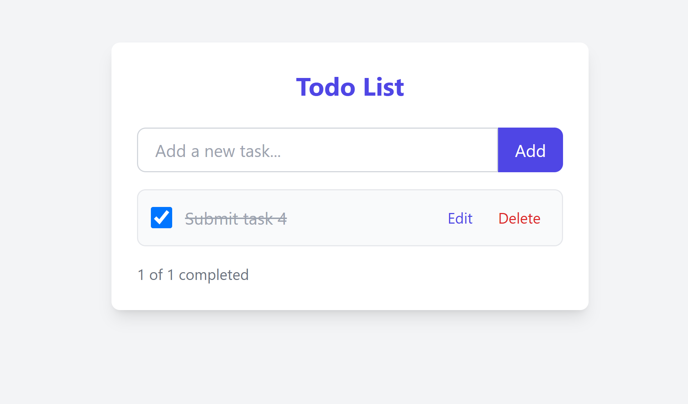
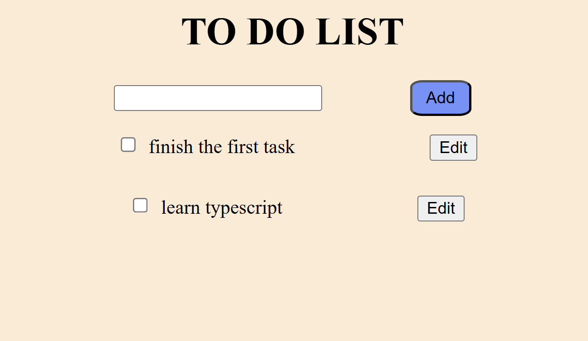

# TO-DO-LIST-APP-with-typecript

This is a simple To-Do List application built using HTML, CSS, and TypeScript.

## Features

- **Add Tasks**: Users can input tasks and add them to the list.
- **Edit Tasks**: Users can edit the content of existing tasks.
- **Delete Tasks**: Users can remove tasks from the list by checking a checkbox.

initial page with no task added

tasks added and with edit buttons and checkbox to mark/delete a task
